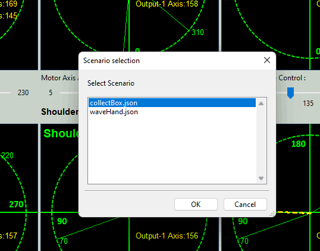
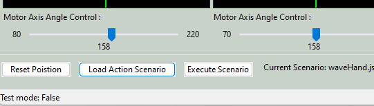

# Braccio_Plus_Robot_Arm_Controller
The robot arms are widely used in the different kinds of Industry 4.0 scenario such as create smart factories with the interconnection of systems that can exchange data, integrate the entire production chain and make decentralized decisions. We want to create a robot arm control software ( with UI ) which allows the user can remote control the [Braccio++ Robot Arm](https://store.arduino.cc/products/braccioplusplus) via Serial port, UDP or TCP and let the robot do some complex actions sequence ( such as grab a box and transfer the boxes on to canvas conveyer). The program is designed and implemented for below purpose : 

- **Testing** : For user who wants to try, learn and test their Braccio++ robot arm. 
- **Education** : For ICS / IOT course  instructor to show robot arm usage cases or use for robot arm related class hands on demo/lab/assignment.  
- **Development/Demo** : For people who wants to build more complex scenario such as a smart factories model for demo and research. 

[TOC]

------

### Introduction

##### Background Knowledge Introduction 

- **Industry 4.0** : The Industry 4.0, or the 4th Industrial Revolution, was made possible by developing new technologies such as cyber-physical systems, the Internet of Things, cloud computing, cognitive computing, and Artificial Intelligence. 
- **Braccio ++ Robot Arm** : The Arduino Braccio ++ offers a multitude of expansive possibilities from the very outset, including a new Braccio Carrier with LCD screen, new RS485 servo motors, and a totally enhanced experience. Detailed introduction please refer to the Braccio official website: https://store.arduino.cc/products/braccioplusplus

##### Braccio Plus Robot Arm Controller Introduction 

The Braccio_Plus_Robot_Arm_Controller provides the Arduino firmware and UI based controller program for user to remote  control the Braccio ++ Robot Arm via serial port, UDP or TCP and let the robot do some complex actions/tasks. This is a example to let the robot arm to execute a box transfer task ( grab a small box and put it into a bigger box ) :

 

To check the entire HD video please refer to this link : [Online Video Link](https://www.youtube.com/watch?v=CKylrEuSwHE)

Braccio_Plus_Robot_Arm_Controller contents two parts : 

**Braccio ++ Arduino firmware** :  The firmware program running on the Braccio's [Arduino Nano RP2040 Connect](https://docs.arduino.cc/hardware/nano-rp2040-connect) to accept the control requests from the controller then drive the Braccio++ servo motors to make the robot arm to finish the action.

**Braccio ++ Controller UI** : The controller with a GUI for user to remote control the robot arm through wire connection (serial comm) or wireless connection (WIFI TCP/UDP comm). It will provide the below function to user :

1. Display the real time potentiometer position / state for the Braccio++ robot arm's six movable parts (`gripper`, `wristRoll`, `wristPitch`, `elbow`, `shoulder`, `base`) . 
2. Control the 6 servo motor ( M1 ~ M6 ) to move the arm. 
3. Allow user to reset the Braccio++ robot arm position, and load their arm action "playbook" to make the arm to finish some complex action. 

This is the user interface screen shot of the Braccio ++ Controller UI : 


`version v0.1.1`


------

### Program Design

This session will introduce the detail design of Braccio ++ Arduino firmware and Braccio ++ Controller UI. The two programs' workflow diagram is shown below:

 

##### Braccio ++ Arduino firmware 

The Braccio ++ Arduino firmware will be loaded/burned in to the Arduino Nano RP2040 board on the Braccio++ robot arm's Arduino carrier, it contents 2 main parts : 

- Communication handling module : For different firmware (`Braccio_serial_comm.ino`, `Braccio_tcp_comm.ino`, `Braccio_udp_comm.ino`), they will provide different communication protocol handler to receive the control request from controller and feed back the action execution result / state . 
- User request handling module : based on the request send from the controller, the firmware main program will call different API to control the robot arm and the other components on the Arduino carrier board ( such as the mini LCD screen and the LED light ). 

##### Braccio ++ Controller UI 

User will use Braccio ++ Controller UI to remote control the robot arm, the program will run the on user's computer with 2 parallel threads : 

- GUI thread : The user interface to handle user's control action. 
- Requests & responds manager thread : convert user's action to robot arm control request command, send the request to the  Braccio ++ Arduino firmware and display the  feed back data / action execution result to UI. 

The user interface design detail is shown below: 


The user's control requests will be put in controller's tasks manager's action queue and send to the Braccio ++ robot arm in sequence, so the user can dynamically change the motor angle when the arm is moving, the arm finished one action, it will send back the action finished response, then the controller will dequeue a new task and send to the Braccio ++ robot arm ( until no new tasks in the action queue). If the user pressed the reset button, the tasks queue will be cleared immediately and the program will send the reset command to the Braccio ++ robot arm.  For the robot arm position monitoring, each arm parts' angle and potentiometer reading will be displayed on the related arm part's control panel. 

The user action, controller state and Braccio ++ firmware execution state timing UML diagram is shown below:


**Important** : When the user load an action playbook into the controller, and press the "execute" button, if the tasks queue is full or have no slot to save all the actions in the playbook, the program will "wait" until the queue has enough slots to hold all the actions in the playbook, then enqueue the all the playbook actions and send to the Arduino.


##### Serial Comm CMD/MSG Format

The communication request / respond bytes will follow below format ( String => bytes under "`utf-8`" encode ) 

| Idx  | Description                          | Src        | Dest       | Format                                                       | Example message                                  |
| ---- | ------------------------------------ | ---------- | ---------- | ------------------------------------------------------------ | ------------------------------------------------ |
| 1    | Fetch all potentiometers'  data      | Controller | Arduino    | `POS`                                                        | `POS`                                            |
| 2    | Reply all potentiometers' reading    | Arduino    | Controller | `POS:<gripper-angle(float)>;<wristRoll-angle>(float);<wristPitch-angle>(float);<elbow-angle>(float);<shoulder-angle>(float);<base-angle(float)>;<timestamp(float)>` | `POS:157.5;157.5;157.5;157.5;157.5;90;117422.00` |
| 3    | Move a servo motor to specific angle | Controller | Arduino    | `MOV<motorID(str)><angle(float)>`                            | `MOVgrip120.5`                                   |
| 4    | Servo motor turn finished            | Arduino    | Controller | `MOV<motorID(str)>Done`                                      | `MOVgripDone`                                    |
| 5    | Reset robot arm                      | Controller | Arduino    | `RST`                                                        | `RST`                                            |
| 6    | Execution error or cmd error         | Arduino    | Controller | `error`/ `notSupportAct`                                     | `error`/ `notSupportAct`                         |

All the moto ID key are 4 chars string and the mapping is shown below : 

```
gripper    = grip
wristRoll  = wrtR
wristPitch = wrtP
elbow      = elbw
shoulder   = shld
base       = base
```


------

### Program Setup

The user need to finish the program / environment setup part before use the program such as assemble the robot arm, install the program need lib and the program edit IDE. 

##### Assemble the Braccio++ Robot Arm 

Follow the below link to assemble the Braccio++ robot arm and link the Arduino Nano to computer with a micro USB cable. 

https://docs.arduino.cc/retired/getting-started-guides/Braccio


If you are using the Windows-OS, please select Device manager => COM port, record the COM port number then set the serial COM bandwidth to **9600** . 


##### Setup Braccio ++ Arduino Firmware 

Development/Execution Environment : C++

Additional Lib/Software Need:  [Arduino IDE 2.2.1](https://www.arduino.cc/en/software)

Hardware needed:

- [Arduino Nano RP2040 Connect](https://docs.arduino.cc/hardware/nano-rp2040-connect)
- [Braccio++ Robot Arm](https://store.arduino.cc/products/braccioplusplus) 

Program Files List : 

| Program File                              | Execution Env | Description                                                  |
| ----------------------------------------- | ------------- | ------------------------------------------------------------ |
| `src\Braccio_src\Braccio_serial_comm.ino` | C++           | Braccio ++ Arduino firmware which provides the Serial COM port [ wired connection ] communication. |
| `src\Braccio_src\Braccio_tcp_comm.ino`    | C++           | Braccio ++ Arduino firmware which provides the network TCP [ wireless connection ] communication. (under development) |
| `src\Braccio_src\Braccio_tcp_comm.ino`    | C++           | Braccio ++ Arduino firmware which provides the network UDP [ wireless connection ] communication. (under development) |


##### Setup Braccio ++ Controller UI 

Development/Execution Environment : python 3.7.4+

Additional Lib/Software Need: 

- Serial Port communication lib: [pySerial](https://pyserial.readthedocs.io/en/latest/pyserial.html)

Hardware needed : micro USB cable to connect to Arduino

Program Files List : 

| Program File                              | Execution Env | Description                                                  |
| ----------------------------------------- | ------------- | ------------------------------------------------------------ |
| `src\Controllers\BraccioController.py`    | python        | The main controller user interface frame.                    |
| `src\Controllers\BraccioControllerPnl.py` | python        | This module will provide the motor slider and potentiometer reading display panel for the controller. |
| `src\Controllers\BraccioCtrlGlobal.py`    | python        | This module is used as a local config file to set constants, global parameters which will be used in the other modules. |
| `src\Controllers\BraccioCtrlManger.py`    | python        | This module is the communication and data manager to connect to Arduino to send the control request and fetch the potentiometer data. |
| `src\Controllers\serialCom.py`            | python        | This module will inheritance the python serial. Serial module with automatically serial port search and connection function. |
| `src\Controllers\Scenario\*`              | json          | Tasks playbook store folder.                                 |


------

### Program Usage

After finished the program setup part, you can start to use the Braccio++ Robot Arm with below steps: 

##### Load the Braccio ++ Arduino Firmware 

If you are the 1st time using the Braccio ++ Robot Arm , you need to upload/burn the firmware program into the Arduino. Open the Arduino IDE, click the lib icon then search key word "Braccio ++" and install the Braccio ++ API lib ( currently we highly recommend you use the web-IDE so you don't need to fix the lib version problem ) :


Then open the file `Braccio_serial_comm.ino` (File => Open => select the ino file), click the compile button. Wait for a while, after compile finished, press the "upload (->)" button to transfer the compiled firmware to the Arduino : 


##### Run the Robot Arm Controller Program

After finished load the firmware and link the arm to your computer, open folder "Controllers" and run the controller UI program with below command : 

```
python BraccioController.py
```

**Connect to the Braccio ++ Arduino**

In the UI top communication selection drop down menu, select the connection type : 


When the controller connect to the Braccio ++ Arduino successfully, the connection indicator will change from gray to green and all the potentiometer's reading and motor position will show on the UI :


To make a specific motor turn to some angle / position, drag the thumber of the related motor controller, when you release the thumber, the angle /position move request will be send to the robot arm:

 

Then you can see the Braccio ++ robot arm will start to move. (Check the detail from the video in the  [Online Video Link](https://www.youtube.com/watch?v=CKylrEuSwHE))


##### Make the Robot Arm Do Complex Action

We also provide the function to let user to setup/edit a "playbook" to make the arm do some complex action such as grab a small box and put it to another big box. 

You can follow the waving hands example in the Scenarios folder, all the play book are json format. User can create their own playbook file and add the action under below format: 

```
{
    "act": "MOV",
    "key": "grip",
    "val": "220"
},
```

- Currently one playbook support user set maximum 50 actions.

After user finished edit the playbook, in the UI select the button "Load Action Scenario", one playbooks selection pop-up dialog will show ( your new playbook will show in the list ) : 



Select the playbook then press "OK" button. Then you can see your playbook will shown in the "Current scenario: xxx.json", when you press the "Execute Scenario" button, your playbook will be execute by the robot arm.



If you edit the playbook file (such as add more action), you don't need to restart the controller or related your playbook, just press the "Execute Scenario" button again, your new added action will be executed by the robot arm. 

If you want to change the robot arm to init position, press the "Reset Position" button. 


------

#### Problem and Solution

Refer to `doc/ProblemAndSolution.md`


------

> Last edit by LiuYuancheng(liu_yuan_cheng@hotmail.com) at 05/11/2023,  if you have any problem, please send me a message. 