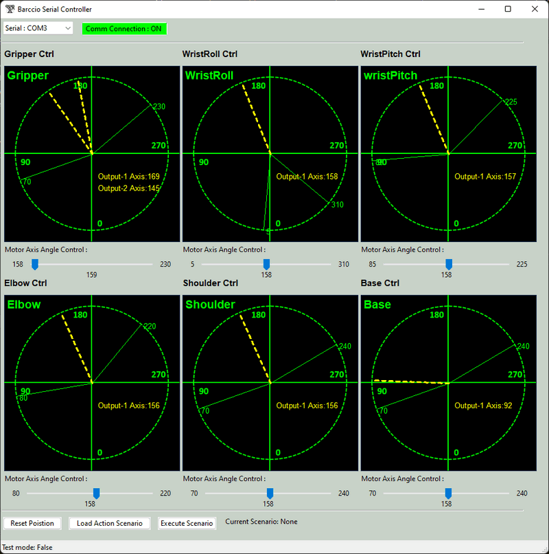
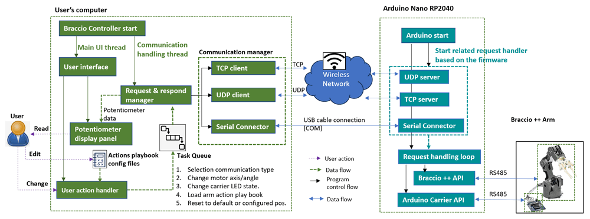
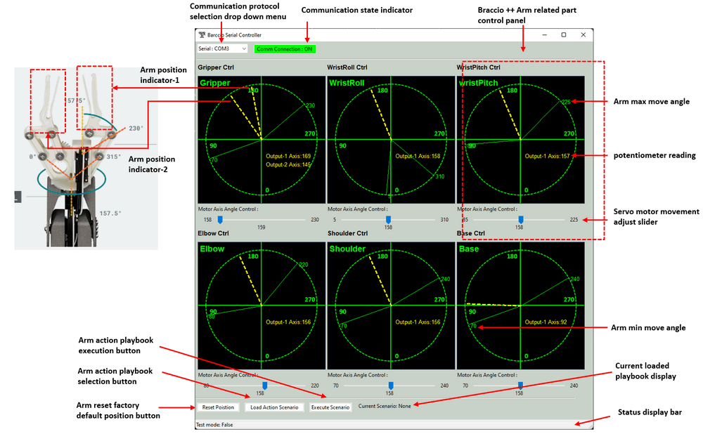
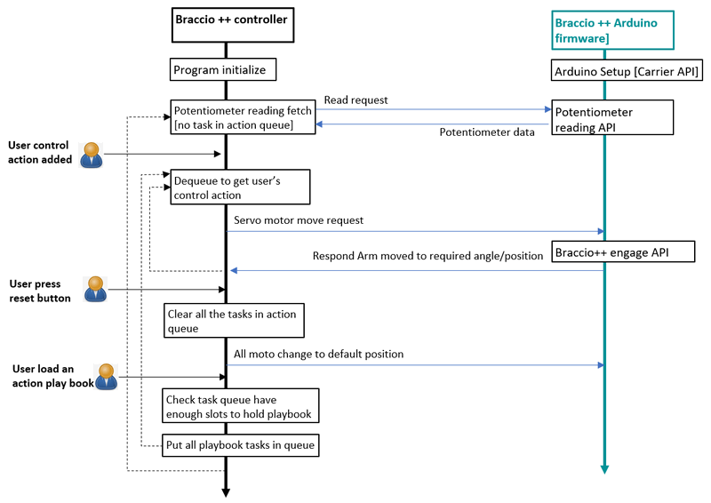
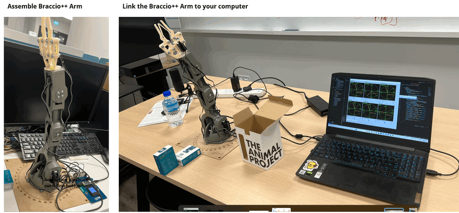
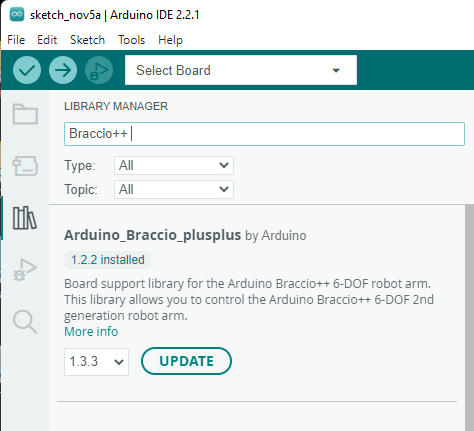
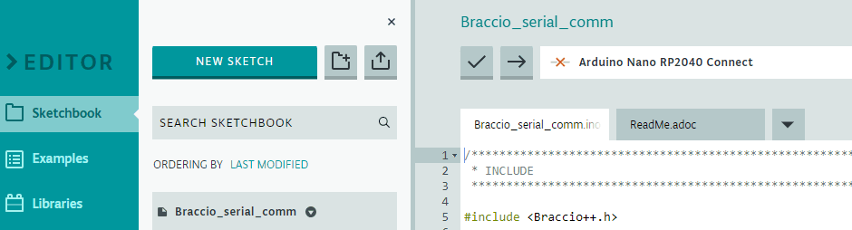
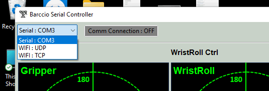
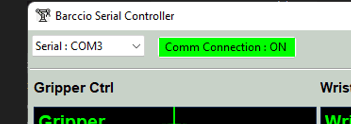
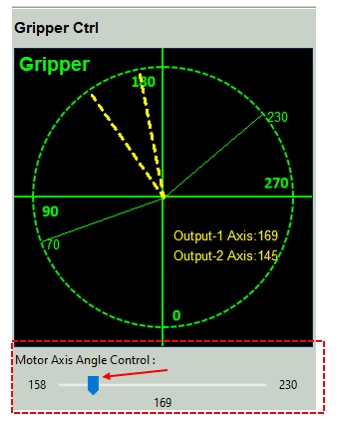

# Braccio_Plus_Robot_Arm_Controller
The robot arms are widely used in the Industry 4.0 scenario such as create smart factories with the interconnection of systems that can exchange data, integrate the entire production chain and make decentralized decisions. We want to create a robot arm control software (UI) which help user to remote control the [Braccio++ Robot Arm](https://store.arduino.cc/products/braccioplusplus) via serial port, UDP or TCP and let the robot do some complex actions sequence (such as grab a box and transfer the boxes on to canvas conveyer). The program is design for below purpose: 

- **Testing** : For user who want to try, learn and test their Braccio robot arm. 
- **Education** : User for hands one usage cases or class demo for robot ICS / IOT course . 
- **Development/Demo** : For people who want to build a smart factories model for demo and research. 

[TOC]

------

### Introduction

**Background Introduction** 

The Industry 4.0, or the 4th Industrial Revolution, was made possible by developing new technologies such as cyber-physical systems, the Internet of Things, cloud computing, cognitive computing, and Artificial Intelligence. 

Arduino Braccio ++ offers a multitude of expansive possibilities from the very outset, including a new Braccio Carrier with LCD screen, new RS485 servo motors, and a totally enhanced experience. Detailed introduction please refer to the Braccio official website: https://store.arduino.cc/products/braccioplusplus

The Braccio_Plus_Robot_Arm_Controller provide the Arduino firmware and UI based controller program for user to remote  control the Braccio ++ via serial port, UDP or TCP and let the robot do some complex actions. This is a example to let the robot arm to execute a box transfer playbook:

 

To check the entire HD video : [Online Video Link](https://www.youtube.com/watch?v=CKylrEuSwHE)

Our program contents 2 parts: 

**Braccio ++ Arduino firmware** :  The firmware program running on the Braccio's [Arduino Nano RP2040 Connect](https://docs.arduino.cc/hardware/nano-rp2040-connect) to accept the control request from the controller then drive the motors to make the robot arm to finish the action.

**Braccio ++ Controller UI** : The controller with a GUI for user to remote control the robot arm through wire connection (serial comm) or wireless connection (Wifi TCP/UDP comm). It will provide the function to user to :

1. Display the real time potentiometer position / state for the robot arm's six parts (`gripper`, `wristRoll`, `wristPitch`, `elbow`, `shoulder`, `base`) . 
2. Control the 6 Servo motor (M1 ~ M6) to move the arm. 
3. Allow user to reset the robot arm position, and load the arm action "playbook" to make the arm to finish the complex action. 

Controller UI screen shot: 




------

### Program Design

This session will introduce the detail design Braccio ++ Arduino firmware and Braccio ++ Controller UI. The program workflow diagram is shown below:

 

##### **Braccio ++ Arduino firmware** 

The Braccio ++ Arduino firmware will be load in to the Arduino Nano RP2040 board, it contents 2 main parts: 

- Communication handling : for different firmware (`Braccio_serial_comm.ino`, `Braccio_tcp_comm.ino`, `Braccio_udp_comm.ino`), they will provide different communication protocol handler to receive the control request from controller and feed back the action execution result / state . 
- Request handling : based on the request, call different API to control the robot arm and the components on the Arduino carrier board. 

##### **Braccio ++ Controller UI** 

The Braccio ++ Controller UI will run on user's computer with 2 thread; 

- GUI thread : The user interface to handle user's control action. 
- Request & responds manager thread : convert user's action to robot arm control request, send the request to the  Braccio ++ Arduino firmware and feed back the data / action execution result to UI. 

The user interface design is shown below: 



The user's control requests will be put in controller's tasks manager queue and send to the Braccio ++ in sequence, so the user can change the motor angle when the arm is moving, the arm finished one action, it will send back the action finished response, then the controller will dequeue the new task and send to the Braccio ++ arm. If the user press the reset button, the tasks queue will be clear and the program will send the reset command to the Braccio ++.  Each arm parts angle , potentiometer reading will be displayed on the related arm part's control panel. The user action, controller state and Braccio ++ firmware execution state timing UML diagram is shown below:



When the user load a action playbook into the system, and press the "execute" button, if the tasks queue is full or have no slot to save all the action in the play book, the program will "wait" until the queue  have enough slot to hold all the action in the playbook, then enqueue the all the playbook actions.


**Serial Comm CMD/MSG format**

The communication request/respond bytes will follow below format (String -> bytes under "utf-8" encode) 

| idx  | Description                       | src        | dest       | format                                                       | example                                          |
| ---- | --------------------------------- | ---------- | ---------- | ------------------------------------------------------------ | ------------------------------------------------ |
| 1    | Fetch all potentiometer data      | controller | Arduino    | `POS`                                                        | `POS`                                            |
| 2    | Reply all potentiometer reading   | Arduino    | controller | `POS:<gripper-angle(float)>;<wristRoll-angle>(float);<wristPitch-angle>(float);<elbow-angle>(float);<shoulder-angle>(float);<base-angle(float)>;<timestamp(float)>` | `POS:157.5;157.5;157.5;157.5;157.5;90;117422.00` |
| 3    | Move servo moto to specific angle | controller | Arduino    | `MOV<motorID(str)><angle(float)>`                            | `MOVgrip120.5`                                   |
| 4    | Servo moto turn finished          | Arduino    | controller | `MOV<motorID(str)>Done`                                      | `MOVgripDone`                                    |
| 5    | Reset robot arm                   | controller | Arduino    | `RST`                                                        | `RST`                                            |
| 6    | execution error or cmd error      | Arduino    | controller | `error`/ `notSupportAct`                                     | `error`/ `notSupportAct`                         |

All the moto ID key are 4 chars str: 

```
gripper    = grip
wristRoll  = wrtR
wristPitch = wrtP
elbow      = elbw
shoulder   = shld
base       = base
```


------

### Program Setup

**Braccio ++ Arduino firmware** 

Development/Execution Environment : C++

Additional Lib/Software Need:  [Arduino IDE 2.2.1](https://www.arduino.cc/en/software)

Hardware needed:

- [Arduino Nano RP2040 Connect](https://docs.arduino.cc/hardware/nano-rp2040-connect)
- [Braccio++ Robot Arm](https://store.arduino.cc/products/braccioplusplus) 

Program Files List : 

| Program File                              | Execution Env | Description                                                  |
| ----------------------------------------- | ------------- | ------------------------------------------------------------ |
| `src\Braccio_src\Braccio_serial_comm.ino` | C++           | Braccio ++ Arduino firmware which provide the Serial COM port [wired connection] communication. |
| `src\Braccio_src\Braccio_tcp_comm.ino`    | C++           | Braccio ++ Arduino firmware which provide the network TCP [wireless connection] communication. (under development) |
| `src\Braccio_src\Braccio_tcp_comm.ino`    | C++           | Braccio ++ Arduino firmware which provide the network UDP [wireless connection] communication. (under development) |


**Braccio ++ Controller UI** 

Development/Execution Environment : python 3.7.4+

Additional Lib/Software Need: 

- Serial Port communication lib: [pySerial](https://pyserial.readthedocs.io/en/latest/pyserial.html)

Hardware needed : micro USB cable to Arduino

Program Files List : 

| Program File                              | Execution Env | Description                                                  |
| ----------------------------------------- | ------------- | ------------------------------------------------------------ |
| `src\Controllers\BraccioController.py`    | python        | The main controller user interface frame.                    |
| `src\Controllers\BraccioControllerPnl.py` | python        | This module will provide the motor controller and potentiometer reading display panel for the controller. |
| `src\Controllers\BraccioCtrlGlobal.py`    | python        | This module is used as a local config file to set constants, global parameters which will be used in the other modules. |
| `src\Controllers\BraccioCtrlManger.py`    | python        | This module is the communication and data manager to connect to Arduino to send the control request and fetch the potentiometer data. |
| `src\Controllers\serialCom.py`            | python        | This module will inheritance the python serial. Serial module with automatically serial port search and connection function. |


------

### Program Usage

##### Assemble the Braccio++ robot arm 

Follow the below link to assemble the Braccio++ robot arm and link the Arduino Nano to computer with the micro USB cable. 

https://docs.arduino.cc/retired/getting-started-guides/Braccio



If you are using the Windows-OS select Device manager => Com port, record the COM port number then set the serial COM bandwidth to 9600. 


##### Load the Braccio ++ Arduino firmware 

If you are 1st time using the Braccio ++, you need to load the firm ware in to the Arduino. Open the Arduino IDE, click the lib icon then search Braccio ++ and install the Braccio ++ API lib (we highly recommend you use the web-IDE so you don't need to fix the lib version problem ) :



Then open the file `Braccio_serial_comm.ino`, click the compile button , after compile finished, press the upload button to transfer the compiled firmware to the Arduino : 




##### Run the robot arm controller program

After finished load the firmware, open folder "controllers" and run the controller UI program: 

```
python BraccioController.py
```

**Connect to the Braccio ++ Arduino**

In the top communication selection drop down menu, select the connection type: 



When the controller connect to the Braccio ++ Arduino successful, the connection indicator will change from gray to green and all the potentiometer's reading and motor position will show on the UI:



To make the moto move a specific angle / position, drag the thumber of the related motor controller, when release the thumber, the angle /position move request will be send to the robot arm:

 

If you want to reset the 