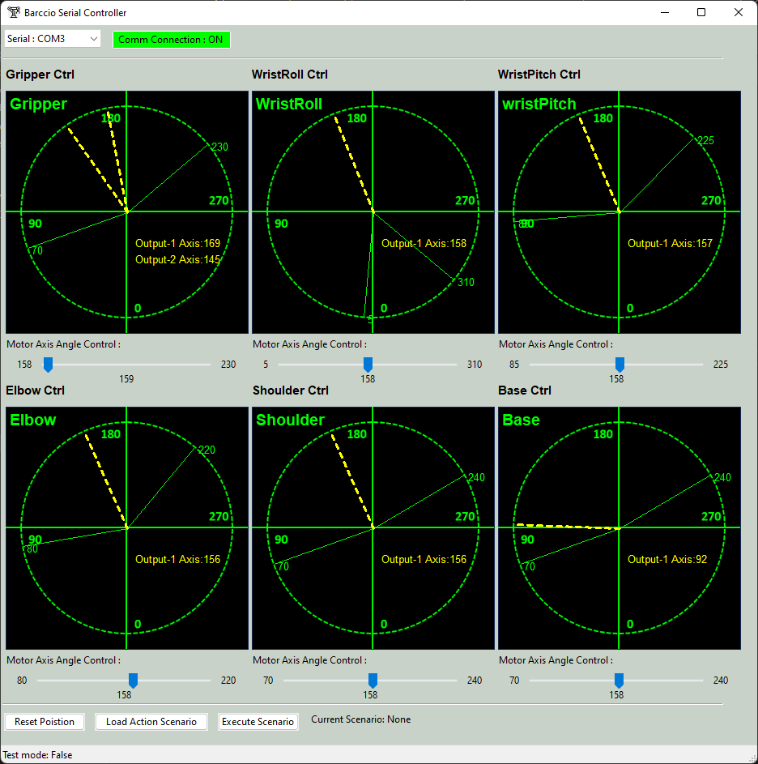

# Braccio_Plus_Robot_Arm_Controller
The robot arms are widely used in the Industry 4.0 scenario such as create smart factories with the interconnection of systems that can exchange data, integrate the entire production chain and make decentralized decisions. We want to create a robot arm control software (UI) which help user to remote control the [Braccio++ Robot Arm](https://store.arduino.cc/products/braccioplusplus) via serial port, UDP or TCP and let the robot do some complex actions sequence (such as grab a box and transfer the boxes on to canvas conveyer). The program is design for below purpose: 

- **Testing** : For user who want to try, learn and test their Braccio robot arm. 
- **Education** : User for hands one usage cases or class demo for robot ICS / IOT course . 
- **Development/Demo** : For people who want to build a smart factories model for demo and research. 

[TOC]

------

### Introduction

The Industry 4.0, or the 4th Industrial Revolution, was made possible by developing new technologies such as cyber-physical systems, the Internet of Things, cloud computing, cognitive computing, and Artificial Intelligence. 

Arduino Braccio ++ offers a multitude of expansive possibilities from the very outset, including a new Braccio Carrier with LCD screen, new RS485 servo motors, and a totally enhanced experience. Detailed introduction please refer to the Braccio official website: https://store.arduino.cc/products/braccioplusplus

Our program contents 2 parts: 

**Braccio ++ Arduino firmware** :  The firmware program running on the Braccio's [Arduino Nano RP2040 Connect](https://docs.arduino.cc/hardware/nano-rp2040-connect) to accept the control request from the controller then drive the motors to make the robot arm to finish the action.

**Braccio ++ Controller UI** : The controller with a GUI for user to remote control the robot arm through wire connection (serial comm) or wireless connection (Wifi TCP/UDP comm). It will provide the function to user to :

1. Display the real time potentiometer position / state for the robot arm's six parts (`gripper`, `wristRoll`, `wristPitch`, `elbow`, `shoulder`, `base`) . 
2. Control the 6 Servo motor (M1 ~ M6) to move the arm. 
3. Allow user to reset the robot arm position, and load the arm action "playbook" to make the arm to finish the complex action. 

Controller UI screen shot: 

------

### Program Design

