# Braccio_Plus_Robot_Arm_Controller

[us English](README.md) | cn 中文

**项目设计目的** ：机械臂广泛应用于各种 Industry 4.0 场景，例如创建智能工厂，实现系统互联互通以交换数据、整合整个生产链并做出分散式决策。我们希望创建一个简单的机械臂控制软件（带 UI），允许用户通过 Serial port、UDP 或 TCP 远程控制 [Braccio++ Robot Arm](https://store.arduino.cc/products/braccioplusplus)，并让机械臂执行一些复杂的动作序列（例如抓取一个盒子并将其转移到传送带上）。该程序的设计和实现旨在达到以下目的：

- **测试** ：供希望尝试、学习和测试其 Braccio++ 机械臂的用户使用。
- **教育** ：供 ICS / IOT 课程讲师展示机械臂使用案例，或用于机器人/自动控制相关课程的动手演示/实验/作业。
- **开发/演示** ：供希望构建更复杂场景（例如用于演示和研究的智能工厂模型）的人员使用。

```python
# Author:      Yuancheng Liu
# Version:     v_0.2.0
# Created:     2023/09/01
# Copyright:   Copyright (c) 2023 LiuYuancheng
# License:     MIT License
```

**Table of Contents**

[TOC]

------

### 1. 項目简介

#### 1.1 项目概述

Braccio_Plus_Robot_Arm_Controller 提供 Arduino 固件和基于 UI 的控制器程序，供用户通过 serial port、UDP 或 TCP 远程控制 Braccio ++ Robot Arm，并让机械臂执行一些复杂的动作/任务。这是一个让机械臂执行盒子搬运任务（抓取一个小盒子并放入一个更大的盒子）的示例：


要查看完整的高清视频，请参考此链接：[在线视频链接](https://www.youtube.com/watch?v=CKylrEuSwHE)

#### 1.2 背景知识介绍

- **Industry 4.0** ：Industry 4.0，即第四次工业革命，通过开发信息物理系统、物联网、云计算、认知计算和人工智能等新技术而成为可能。
- **Braccio ++ Robot Arm** ：Arduino Braccio ++ 从一开始就提供了多种扩展可能性，包括带有 LCD 屏幕的新 Braccio Carrier、新的 RS485 servo motors 以及全面增强的用户体验。详细介绍请参考 Braccio 官方网站：https://store.arduino.cc/products/braccioplusplus

#### 1.3 项目详细介绍

Braccio_Plus_Robot_Arm_Controller 包含两个部分：

**Braccio ++ Arduino firmware** ：运行在 Braccio 的 [Arduino Nano RP2040 Connect](https://docs.arduino.cc/hardware/nano-rp2040-connect) 上的固件程序，用于接收来自控制器的控制请求，然后驱动 Braccio++ servo motors 以使机械臂完成动作。

**Braccio ++ Controller UI** ：带有 GUI 的控制器，供用户通过有线连接（serial comm）或无线连接（WIFI TCP/UDP comm）远程控制机械臂。它将为用户提供以下功能：

1. 实时显示 Braccio++ 机械臂六个可动部件（`gripper`、`wristRoll`、`wristPitch`、`elbow`、`shoulder`、`base`）的电位器位置/状态。
2. 控制 6 个 servo motor（M1 ~ M6）以移动机械臂。
3. 允许用户重置 Braccio++ 机械臂位置，并加载其机械臂动作“动作脚本”以使机械臂完成一些复杂动作。

这是 Braccio ++ Controller UI 的用户界面截图：

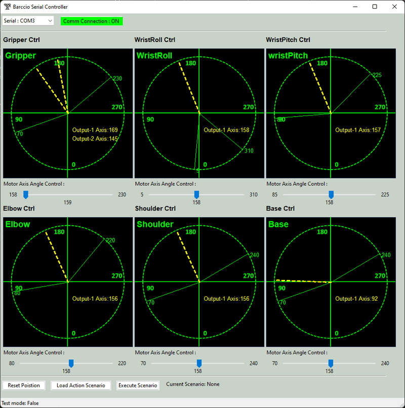

`version v0.1.1`

------

### 2. 程序设计

本节将介绍 Braccio ++ Arduino firmware 和 Braccio ++ Controller UI 的详细设计。这两个程序的工作流程图如下所示：

 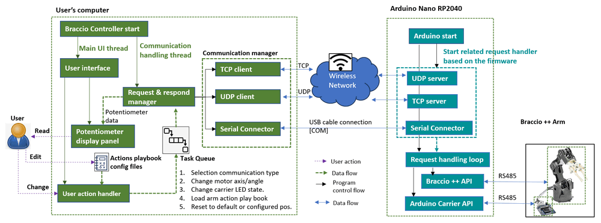

#### 2.1 Braccio ++ Arduino firmware

Braccio ++ Arduino firmware 将被加载/烧录到 Braccio++ 机械臂的 Arduino carrier 上的 Arduino Nano RP2040 板中，它包含 2 个主要部分：

- 通信处理模块：对于不同的固件（`Braccio_serial_comm.ino`、`Braccio_tcp_comm.ino`、`Braccio_udp_comm.ino`），它们将提供不同的通信协议处理器来接收来自控制器的控制请求并反馈动作执行结果/状态。
- 用户请求处理模块：根据控制器发送的请求，固件主程序将调用不同的 API 来控制机械臂和 Arduino carrier board 上的其他组件（例如迷你 LCD screen 和 LED light）。

#### 2.2 Braccio ++ Controller UI

用户将使用 Braccio ++ Controller UI 远程控制机械臂，该程序将在用户的计算机上以 2 个并行线程运行：

- GUI 线程：用户界面，用于处理用户的控制动作。
- 请求与响应管理器线程：将用户的动作转换为机械臂控制请求命令，将请求发送到 Braccio ++ Arduino firmware 并将反馈数据/动作执行结果显示到 UI。

用户界面设计详情如下：

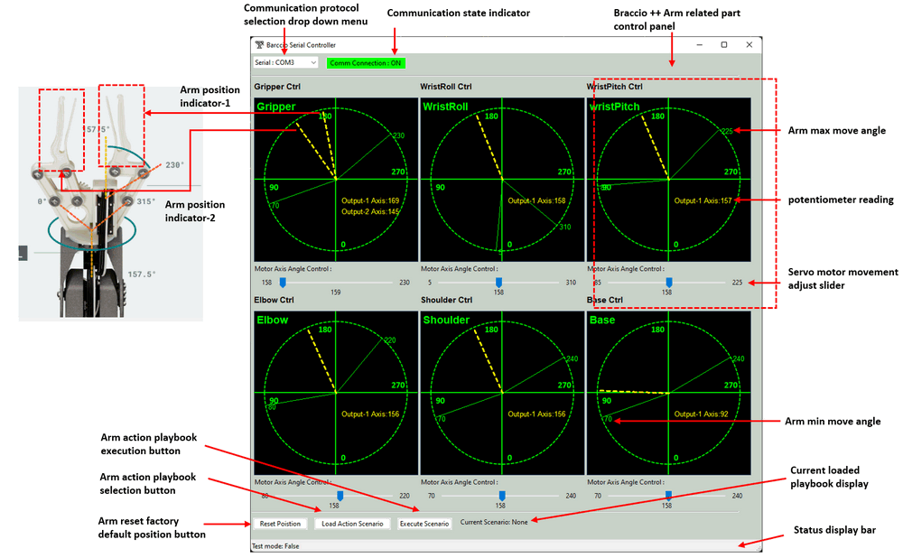

用户的控制请求将被放入控制器的任务管理器的动作队列中，并以 FIFO 顺序发送到 Braccio ++ 机械臂，因此用户可以在机械臂移动时动态改变电机角度，机械臂完成一个动作后，它将发送回动作完成响应，然后控制器将出队一个新任务并发送到 Braccio ++ 机械臂（直到动作队列中没有新任务）。如果用户按下重置按钮，任务队列将立即清除，程序将向 Braccio ++ 机械臂发送重置命令。对于机械臂位置监控，每个机械臂部件的角度和电位器读数将显示在相关机械臂部件的控制面板上。

用户动作、控制器状态和 Braccio ++ firmware 执行状态的时序 UML diagram 如下所示：

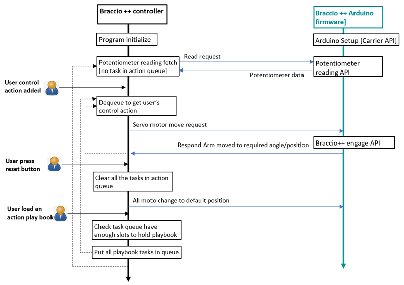

**重要提示** ：当用户将动作脚本加载到控制器中并按下“execute”按钮时，如果任务队列已满或没有足够的槽位来保存动作脚本中的所有动作，程序将“等待”直到队列有足够的槽位来容纳动作脚本中的所有动作，然后将所有动作脚本动作入队并发送到 Arduino。

#### 2.3 串口通信命令/消息格式

通信请求/响应字节将遵循以下格式（字符串 => “`utf-8`”编码下的字节）

| 序号 | 描述                 | 源         | 目标       | 格式                                     | 示例消息                                         |
| :--- | :------------------- | :--------- | :--------- | :--------------------------------------- | :----------------------------------------------- |
| 1    | 获取所有电位器数据   | Controller | Arduino    | `POS`                                    | `POS`                                            |
| 2    | 回复所有电位器读数   | Arduino    | Controller | `POS:;(float);(float);(float);(float);;` | `POS:157.5;157.5;157.5;157.5;157.5;90;117422.00` |
| 3    | 将舵机移动到特定角度 | Controller | Arduino    | `MOV`                                    | `MOVgrip120.5`                                   |
| 4    | 舵机转动完成         | Arduino    | Controller | `MOVDone`                                | `MOVgripDone`                                    |
| 5    | 重置机械臂           | Controller | Arduino    | `RST`                                    | `RST`                                            |
| 6    | 执行错误或命令错误   | Arduino    | Controller | `error`/ `notSupportAct`                 | `error`/ `notSupportAct`                         |

所有电机ID键都是4个字符的字符串，映射关系如下所示：

```python
gripper    = grip
```


------

### 3. 程序设置

用户在使用程序之前需要完成程序/环境设置部分，例如组装机械臂、安装程序所需的 lib 和程序编辑 IDE。

#### 3.1 组装Braccio++机械臂

按照以下链接组装 Braccio++ 机械臂，并使用 micro USB cable 将 Arduino Nano 连接到计算机。

https://docs.arduino.cc/retired/getting-started-guides/Braccio

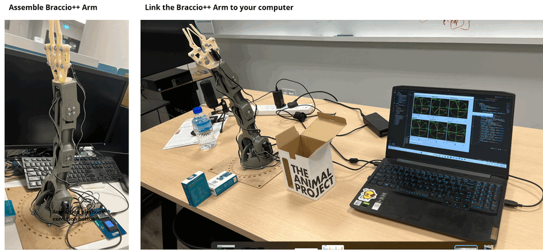

如果您使用的是 Windows-OS，请选择“设备管理器”=>“COM 端口”，记录 COM 端口号，然后将串口通信带宽设置为 **9600**。

#### 3.2 设置Braccio ++ Arduino固件

开发/执行环境：C++

额外所需库/软件：[Arduino IDE 2.2.1](https://www.arduino.cc/en/software)

所需硬件：

- [Arduino Nano RP2040 Connect](https://docs.arduino.cc/hardware/nano-rp2040-connect)
- [Braccio++ Robot Arm](https://store.arduino.cc/products/braccioplusplus)

程序文件列表：

| 程序文件                                  | 执行环境 | 描述                                                         |
| :---------------------------------------- | :------- | :----------------------------------------------------------- |
| `src\Braccio_src\Braccio_serial_comm.ino` | C++      | Braccio ++ Arduino固件，提供串口 [有线连接] 通信。           |
| `src\Braccio_src\Braccio_tcp_comm.ino`    | C++      | Braccio ++ Arduino固件，提供网络 TCP [无线连接] 通信。(开发中) |
| `src\Braccio_src\Braccio_tcp_comm.ino`    | C++      | Braccio ++ Arduino固件，提供网络 UDP [无线连接] 通信。(开发中) |

 

#### 3.3 设置Braccio ++ 控制器UI

开发/执行环境：python 3.7.4+

额外所需库/软件：

- 串口通信库：[pySerial](https://pyserial.readthedocs.io/en/latest/pyserial.html)

所需硬件：用于连接 Arduino 的 micro USB cable

程序文件列表：

| 程序文件                                  | 执行环境 | 描述                                                         |
| :---------------------------------------- | :------- | :----------------------------------------------------------- |
| `src\Controllers\BraccioController.py`    | python   | 主控制器用户界面框架。                                       |
| `src\Controllers\BraccioControllerPnl.py` | python   | 该模块将为控制器提供电机滑块和电位器读数显示面板。           |
| `src\Controllers\BraccioCtrlGlobal.py`    | python   | 该模块用作本地配置文件，用于设置将在其他模块中使用的常量和全局参数。 |
| `src\Controllers\BraccioCtrlManger.py`    | python   | 该模块是连接 Arduino 以发送控制请求和获取电位器数据的通信和数据管理器。 |
| `src\Controllers\serialCom.py`            | python   | 该模块将继承 python serial.Serial 模块，并具有自动串口搜索和连接功能。 |
| `src\Controllers\Scenario\*`              | json     | 任务动作脚本存储文件夹。                                     |


------

### 4. 程序使用

完成程序设置部分后，您可以按照以下步骤开始使用 Braccio++ Robot Arm：

#### 4.1 加载Braccio ++ Arduino固件

如果您是第一次使用 Braccio ++ Robot Arm，您需要将固件程序上传/烧录到 Arduino 中。打开 Arduino IDE，点击库图标，然后搜索关键词“Braccio ++”并安装 Braccio ++ API 库（目前我们强烈建议您使用 web-IDE，这样您就不需要解决库版本问题）：

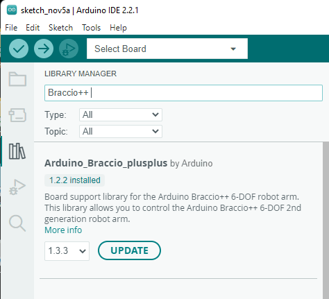

然后打开文件 `Braccio_serial_comm.ino`（文件 => 打开 => 选择 ino 文件），点击编译按钮。等待片刻，编译完成后，按下“上传 (->)”按钮将编译好的固件传输到 Arduino：

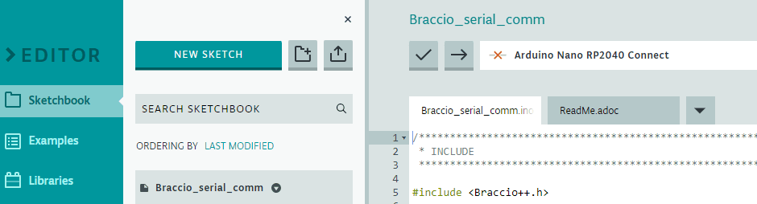

#### 4.2 运行机械臂控制器程序

加载固件并将机械臂连接到计算机后，打开“Controllers”文件夹，并使用以下命令运行控制器 UI 程序：

```bash
python BraccioController.py
```

#### 4.3 连接到Braccio ++ Arduino

在 UI 顶部通信选择下拉菜单中，选择连接类型：

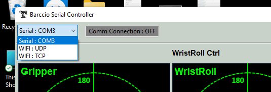

当控制器成功连接到 Braccio ++ Arduino 后，连接指示器将从灰色变为绿色，并且所有电位器的读数和电机位置将显示在 UI 上：

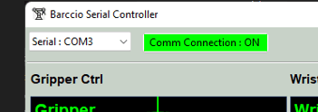

要使特定电机转动到某个角度/位置，请拖动相关电机控制器的滑块，当您释放滑块时，角度/位置移动请求将发送到机械臂：

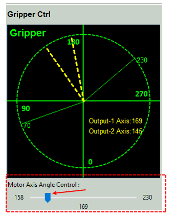

然后您可以看到 Braccio ++ 机械臂将开始移动。（详情请查看[在线视频链接](https://www.youtube.com/watch?v=CKylrEuSwHE)中的视频）

#### 4.4 让机械臂执行复杂动作

我们还提供了让用户设置/编辑“动作脚本”的功能，以使机械臂执行一些复杂动作，例如抓取一个小盒子并将其放入另一个大盒子。

您可以参考 Scenarios 文件夹中的挥手示例，所有动作脚本都是 json 格式。用户可以创建自己的动作脚本文件并按照以下格式添加动作：

```python
{
    "act": "MOV",
    "key": "grip",
    "val": "220"
},
```

- 目前一个动作脚本最多支持用户设置 50 个动作。

用户编辑完动作脚本后，在 UI 中选择“Load Action Scenario”按钮，将显示一个动作脚本选择弹出对话框（您的新动作脚本将显示在列表中）：

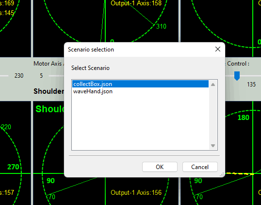

选择动作脚本，然后按下“确定”按钮。然后您可以看到您的动作脚本将显示在“Current scenario: xxx.json”中，当您按下“Execute Scenario”按钮时，您的动作脚本将由机械臂执行。

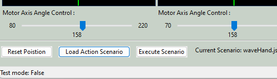

如果您编辑了动作脚本文件（例如添加更多动作），您无需重新启动控制器或相关的动作脚本，只需再次按下“Execute Scenario”按钮，您新添加的动作将由机械臂执行。

如果您想将机械臂更改为初始位置，请按下“Reset Position”按钮。

------

### 5. 问题与解决方案

请参考 `doc/ProblemAndSolution.md`

https://www.linkedin.com/pulse/braccio-plus-robot-arm-controller-yuancheng-liu-h5gfc

------

> Last edit by LiuYuancheng(liu_yuan_cheng@hotmail.com) at 05/11/2023,  if you have any problem, please send me a message. 