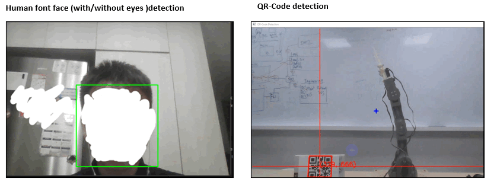
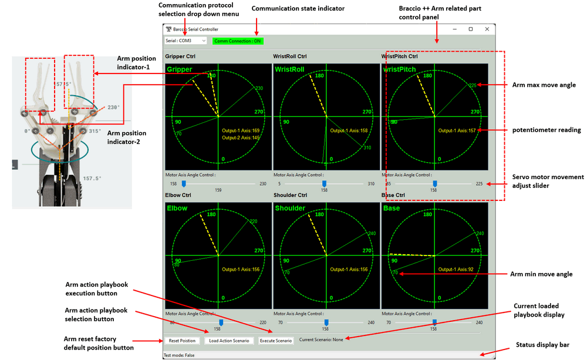

# Smart IoT Robot Emulator 

We want to create a simple **IoT** **Robot Emulation System** which can interactive with the environment and human to simulate the smart robot's action or the smart manufacturing process. The robot system will use the classic distributed **IoT** hub-control type framework. Each components are linked by wireless connection. The whole system contents 4 main part :

- Several eye / sense components ( camera, microphone and sensors ) . 
- One or more face / info-broadcast components (screen and speaker) . 
- One center controller / decision maker. 
- Several Braccio_Plus_Robot_Arm with the controllers. 

All the components will communicate with each other via WIFI or 4G/5G, so they can work together in different place ( or geo-location ) : Such as simulate in a smart manufacture factory, the robot arms can be located in production pipeline room, another eye can be in the warehouse, the center controller and info-broadcast nodes can be in the control room.

[TOC]

------

### Introduction

The robot emulation system includes 4 main module, the robot eye, the robot face , the robot head and the robot body. Each module will connect to the head module via Wifi or 5G wireless connection. The robot system diagram is shown below: 

In each system, there will be one head node controls several eye, face and arm nodes. The main function of each node is shown below : 

##### 1. Robot Eye Module

The "**Eye**" module ( running on the Eye node-N ) contents a camera objects detection program to identify human or items for the robot to sense the environment. It also has a UDP server interface for other robot modules ( such as robot head ) to connect to it, then fetch the detection result and dynamically fine tune the detection control parameters to improve the detection accuracy.

##### 2. Robot Face Module

The "**Face**" module ( running on the Face node-N ) is the "bridge" to link users and robot, it contents several different GUIs to show the robot's information, robot current state to the user, and it also provides the interface for user to control the robot's action. The user can interact with the robot via the face module.

##### 3. Robot Head Module

The "**Head**" module ( running on Head node ) is the decision maker to control all the other modules, it will fetch the detection information from the eye modules, get the control request from the face module. Then control the body (arm) to do the action and show the related state/information on the face module. Currently the action includes the formular calculation action ( such as calculate how to move the arm to grab a detected box ) and playbook actions ( such as do some complex action based on user's pre-set playbook ), in the future, we may integrate AI in the decision maker to make the robot can do "more".

##### 4. Robot Body Module

The "**Body**" module ( running on the `Arm node-N` ) includes several Braccio_Plus_Robot_Arm, each robot arm will connect with a controller to accept the commands from the head module, then do complex action and works with each other.

#### System Demo

We provide 2 demos to show how the robot system works interact with people and environment.

##### Demo 1: Detect human and show arm control

The robot will detect whether someone is watching it. If it identifies human is watching it, it will wave its hands to attract the people's attention, then try to grab a small box next to it and handle over the box to people.

**Video link of the demo 1** : [watch demo1 on YouTube](https://www.youtube.com/watch?v=Wa1tdIXH6zc)

Detail demo progress : 

1. The eye module will keep detecting human face ( with 2 eyes to make sure people is watching it ), if no people is watching the robot face, the face node will show a "sleeping emoji" .

2. If the eye node detects a people is watching the robot face more than 2 seconds, the robot will wake up and prepare to show some demo to the people ( wave its robot arm and show "I will show some demo" on face UI ).

3. If the eye detect the people is watching the arm, then the head will control the arm to grab a small box next to it and hand over to the people. 

4. If the eye node doesn't detect people any more, the head will change the face to sleep emoji and rest the arm to default position.

   

##### Demo 2 : Detect QR-code position and grab the box

The robot will detect the position of the QR-code in the video picture, if a box ( with a QR-code on it ) is detected, the robot will try to grab the box and transfer it to a user pre-set location.

Video link of the demo 2 : [watch demo2 on YouTube](https://www.youtube.com/watch?v=IK6gI5Kcni8)

Detail demo steps : 

1. The eye node will keep detecting QR-code, if no QR-Code detected, the face node will show a sleeping emoji. 
2. If the eye node detects any QR-Code, it will send the QR-Code location to head node, the face node will show people the robot "see" the QR-code and it will try to grab the QR-code box.
3. The head node will calculate the arm movement steps based on the QR-code position, then control to arm to grab the QR-code box and transfer it to the user's pre-set position.
4. If the eye detect no more QR-code, the head node will change the face to sleep state and reset the arm to default position.

------

### Program Design

Each module of the robot system will follow below diagram to work with each other : 

`version v1.0.2` 

#### Design of Robot Eyes module

The robot eye module contents two main parts ( Camera detection module and UDP host ) : 

- **Camera detection module** : This module will capture the video from the camera, then detect the object in the video based on the user's detection configuration. This module will also provide a UI to show the detection result.
- **UDP service host** : A UDP server will be start in a parallel sub-thread to handle the detection parameters change request from other module and handle the current detection result fetch request.

The Detailed Robot Eye Module's work flow is shown below :

Currently the detector provide two types of detection : 

**Human face detection ** will detect human face for the robot to interact with people : 

- Normal face detection : detect multiple human faces in the video stream and save all the faces' position.
- Detect face with 2 eyes : detect both human face and two eye, only save the position with both face and two eyes are detected. ( So the detect result only contents people who is facing direct to the camera )

**QR code detection** will detect the QR-code for robot to interact with the environment : 

- Normal QR-code detection : detect multiple QR-code in the video and save all the QR-code position. 
- QR-code detect and decode : detect QR-code and decode the QR-code information during the detection. ( So if we put different QR-code on different objects , we can control the robot to grab the specific object based on the user's preset QR-code info )

If we enable the detection result display flag, the program will provide a CV-image window to show the detection result in real time as shown below: 

Detail program doc :  [Robot Eye Module ( Camera Detector ) Design document](https://github.com/LiuYuancheng/Braccio_plus_robot_arm_control/blob/main/src/RobotEye/readme.md)

Hardware needed : Web camera 

#### Design of Robot Face Module

The Robot Face is the Interactive interface to make the robot can communicate with user to accept the user's control command and feedback the robot current state. Three main user interfaces are provided : Robot Arm controller UI, Robot face emoji UI and the Robot eye detection UI.

**Robot Arm Controller UI** : The interactive interface for user to remote control the robot arm through wire connection (serial comm) or wireless connection (WIFI TCP/UDP comm). It will provide the below function to user :

1. Display the real time potentiometer position / state for the Braccio++ robot arm's six movable parts (`gripper`, `wristRoll`, `wristPitch`, `elbow`, `shoulder`, `base`) . 
2. Control the 6 servo motor ( M1 ~ M6 ) to move the arm. 
3. Allow user to reset the Braccio++ robot arm position, and load their arm action "playbook" to make the arm to finish some complex action. 

**Robot Face Emoji UI** : The interactive interface ( a emoji and a chat text field ) for robot to tell user its current state ( such as show the user whether it is free to receive new commands or it is doing some action ) . During the face detection demo, it will also show the introduction to guide the user to follow the demo steps.

**Robot Eye Detection UI** :  The interface to show the current eye module detection result. ( High light the detected object and show the object position in the image )

The Face module UI is shown below ( detect human and react ) : 

Detail program doc :  [Robot Face Module Design document](https://github.com/LiuYuancheng/Braccio_plus_robot_arm_control/blob/main/SmartRobot.md)

Hardware needed : Full HD screen

#### Design of Robot Head Module

The Robot head is the main controller-hub to link all other modules together : it will fetch the information from eye module, analysis the situation then ask face and body to do the related action. Each robot can only have one head, if there is more than one robots in a subnet, the robot head can decide to connect to which eye nodes, face nodes and body nodes. We also provide the ability which allow two robot to "share" a same arm ( one master and many slaves ), so for a robot arm, if the master head node is not giving it a task, other slave node can also control it to finish some task. Once the master head request its arm do some tasks, the arm controller will clear all the slaves' queued tasks in its task queue.

The Head module contents one decision maker and three types of client to communicate with other 3 module via UDP .

- **Decision maker** : The decision maker module is the center processer of the robot head, it will load several pre-set robot arm action playbook and config file. It will fetch the environment detection result from the eye module, collect user's command from the controller module then create the action tasks list and send to the robot arm module and update the face display. 
- **Eye Connection Client** : A communication client with a list of UDP clients used to connect multiple robot Eyes to fetch detection result. 
- **Face Display client** : A communication client with a list of UDP clients to send the display info to different type of Face module. 
- **Arm Connection Client** :  A communication client with a list of UDP client to send the control action to different robot arm controllers. 

Detail program doc :  [Robot Head Module Design document](https://github.com/LiuYuancheng/Braccio_plus_robot_arm_control/blob/main/SmartRobot.md)

Hardware needed : N.A

#### Design of Robot Body Module

The Robot Body "Braccio_Plus_Robot_Arm_Controller"  contents two parts : 

1. Braccio ++ Arduino firmware and Braccio ++ robot arm 
2. Braccio ++ Controller UI 

The work flow is shown below : 

**Braccio ++ Arduino firmware** 

The Braccio ++ Arduino firmware will be loaded/burned in to the Arduino Nano RP2040 board on the Braccio++ robot arm's Arduino carrier, it contents 2 main parts : 

- Communication handling module : For different firmware (`Braccio_serial_comm.ino`, `Braccio_tcp_comm.ino`, `Braccio_udp_comm.ino`), they will provide different communication protocol handler to receive the control request from controller and feed back the action execution result / state . 
- User request handling module : based on the request send from the controller, the firmware main program will call different API to control the robot arm and the other components on the Arduino carrier board ( such as the mini LCD screen and the LED light ). 

**Braccio ++ Controller UI** 

User will use Braccio ++ Controller UI to remote control the robot arm, the program will run the on user's computer with 2 parallel threads : 

- GUI thread : The user interface to handle user's control action. 
- Requests & responds manager thread : convert user's action to robot arm control request command, send the request to the  Braccio ++ Arduino firmware and display the  feed back data / action execution result to UI. 

The user interface design detail is shown below: 

Detail program doc :  [Robot Body Module Design document](https://github.com/LiuYuancheng/Braccio_plus_robot_arm_control/blob/main/README.md)

Hardware needed : Braccio++ robot arm

------

### Program Setup and Execution 

To setup each sub system of the robot, please follow the `readme.md` file in the program's source code folder of each mode: 

- Robot Arm : https://github.com/LiuYuancheng/Braccio_plus_robot_arm_control/blob/main/README.md
- Robot Eye : https://github.com/LiuYuancheng/Braccio_plus_robot_arm_control/blob/main/src/RobotEye/readme.md
- Robot Head :  https://github.com/LiuYuancheng/Braccio_plus_robot_arm_control/tree/main/src/RobotHead/readme.md
- Robot Face : Set the showUI flag of each module's config file to true, the related UI will be shown in the face module. 

------

### Problem and Solution

Refer to `doc/ProblemAndSolution.md`

------

> Last edit by LiuYuancheng(liu_yuan_cheng@hotmail.com) at 19/11/2023, if you have any problem, please send me a message. 