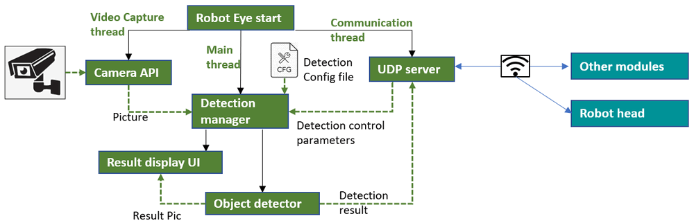

# Robot Eye Module ( Camera Detector )

**Design Purpose** : We want to create a camera object ( face, Qr-code... ) detection module which can integrate in the robot system  as the 'Eye'. It will provide the UDP connection service interface for other modules ( such as robot head ) to fetch the detection result and dynamically fine tune the detection result. 

[TOC]

------

### Introduction 

The module contents two main parts (The camera detection module and the UDP host ) : 

##### Camera detection module 

- This module will capture the video from the camera, then detect the object in the video based on the user's detection configuration, this module will provide a UI to show the detection result. 

##### UDP service host 

- A UDP server will be start in a parallel sub thread to serve the detection parameters change request from other module and send the current detection result to the connected module.

The Robot Eye work flow is shown below : 



`version v1.01`


------

### Program Design

Currently the detector provide two types of detection : 

**Human face detection ** will detect human face for the robot to interact with people. 

- Normal face detection : detect multiple human face in the video stream and save all the face position. 
- Detect face with 2 eyes : detect human face and two eye, only save the position with both face and two eyes are detected. (So the detect result only contents people who is facing direct to the camera)

**QR code detection** will detect the QR code for robot to interact with the environment. 

- Normal QR-code detection : detect multiple QR-code in the video and save all the QR-code position. 
- QR-code detect and decode : decode the QR-code information during the detection. (So if we put different Qr-code on different objects , we can control the robot to grab the specific one based on the QR-code info )

If we enable the detection result display flag, the program will provide a CV-image window to show the detection result in real time as shown below: 


------

### Program Setup

The user need to finish the program / environment setup part before use the program such as connect to the camera, install the program need lib and the program edit IDE. 

**Development/Execution Environment** : python 3.7.4+

**Additional Lib/Software Need** : 

- OpenCV python lib : [cv2](https://pypi.org/project/opencv-python/) `pip install opencv-python`
- UDP communication lib (local lib file) :  `../lib/udpCom.py`
- Configure file loading lib (local lib file) : `../lib/ConfigLoader.py`

**Hardware needed** : Camera with min resolution 640 x 480  

**Program Files List** : 

| Program File         | Execution Env | Description                                                  |
| -------------------- | ------------- | ------------------------------------------------------------ |
| `robotEyeRun.py`     | python        | The main robot eye program.                                  |
| `robotEyeGlobal.py`  | python        | This module is used as a local config file to set constants, global parameters which will be used in the other modules. |
| `camDetector.py`     | python        | This module will open the camera to capture the video (pic) then use OpenCV to detect different items (such as face, Qr code). All the detector class are inherited from the parent class `<camDetector>` |
| `robotEyeConfig.txt` |               | Detection configuration file.                                |


------

### Program Usage

This section will introduce how to usage robot eye program : 

##### Set the detection configure file 

Follow below example to setup the config file (`robotEyeConfig.txt`) : 

```
# This is the config file template for the module <robotEyeRun.py>
# Setup the paramter with below format (every line follows <key>:<val> format, the
# key can not be changed):

#-----------------------------------------------------------------------------
# Set the detector type: FD: face detector, QD: Qr-code detector (string)
DET_TYPE:QD
# UDP service port (int)
UDP_PORT:3004

#-----------------------------------------------------------------------------
# Set the detector parameters

# Init Camera Idx (int)
CAM_IDX:0
# Show detection result UI, True: pop up the result display window. (bool)
SHOW_UI:True
# Display window name (string)
WIN_NAME:Face-detection
# Image capture frame interface FPS_INT (float)
FPS_INT:0.1
# face detection special flag : whether detect eyes.(bool)
DET_EYE:False
# Qr code detect special flag: whether decode qr code information.(bool)
QR_DECODE:False
```

##### Run the robot eye program

cmd : 

```
python3 robotEyeRun.py
```


------

### Problem and Solution

Refer to `doc/ProblemAndSolution.md`


------

> Last edit by LiuYuancheng(liu_yuan_cheng@hotmail.com) at 19/11/2023, if you have any problem, please send me a message. 